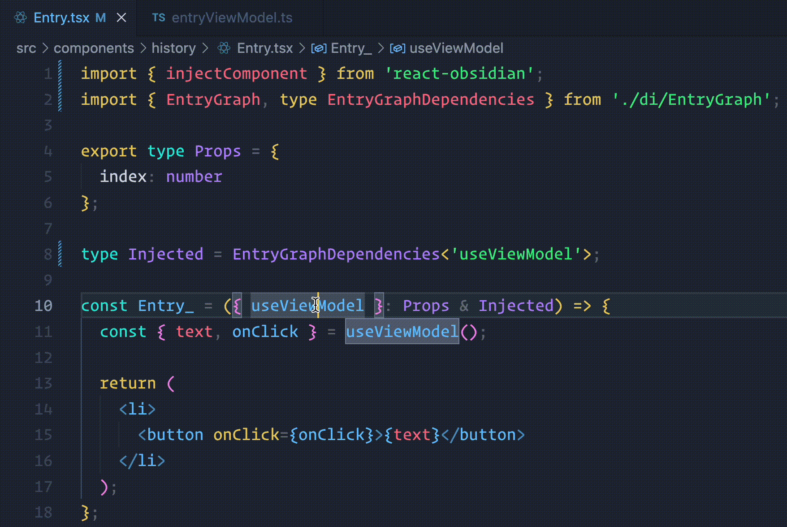
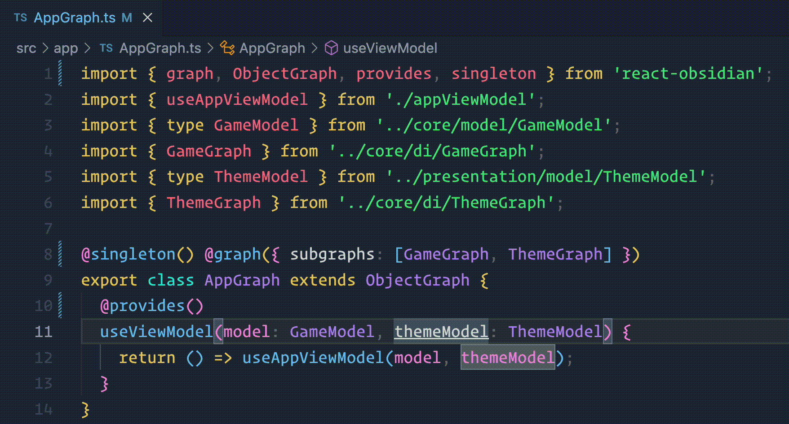

This extension provides go to definition support for dependencies injected by the [Obsidian](https://github.com/wix-incubator/obsidian) dependency injection framework.

## Go to definition for dependencies injected into hooks

## Go to definition for dependencies injected into providers

